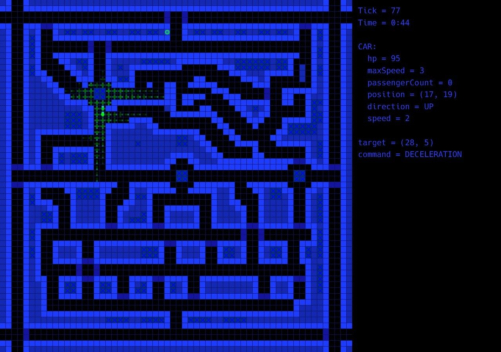
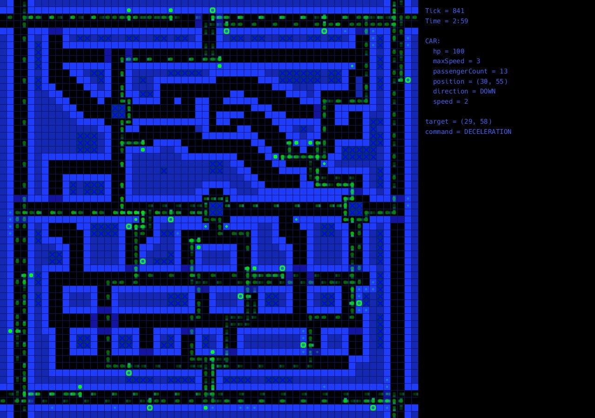
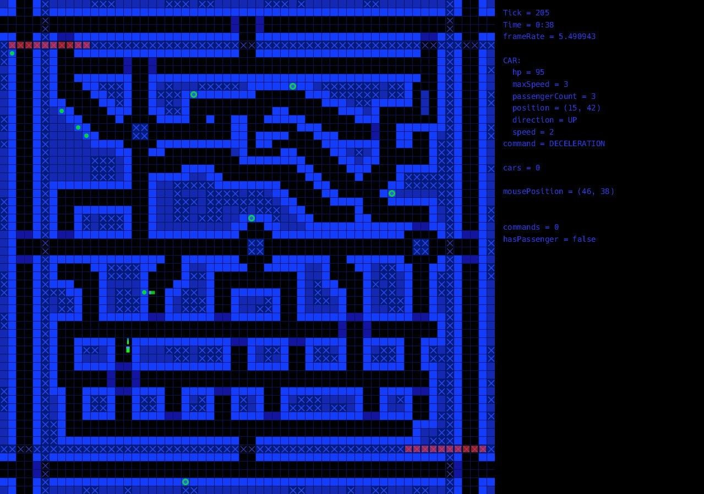

# CodingCup
Coding Tomorrow Cup was a programming contest organized by EcoSim.

The task was to write a self-driving car's program to take the Passengers to their destination while avoiding collisions and following traffic rules properly.
Lots of possible continuations of the game was taken into account to find the optimal step (turning left, turning right, slowing, accelerating).
Breaking the traffic rules, crashing, driving on grass or sidewalk and emergency-braking involved a point deduction, so the car had to be fast, but drive safely.

The green rectangle represents the car, the dark cells represents the road, the Passengers are green dots and their destinations are green rings.
The visualisation of the data had to be written manually since the IO formats where hardly interpretable to a human (matrices and vectors).

The first image shows the possible futures and how important and how likely they are:

This image shows the every position of the car, the brightness represents the speed of the car.
Notice that darker (faster) positions are mostly on the long, straight roads, while the brighter (slower) positions are near the crossroads, or next to a pedestrian or its destination.

The last image shows a run during the final, the red stripes represent a train.
When a train hits the car, its HP will instantly be 0, so the edges are now danger zones!

And finally, a real route from the final, the darker car represents the next position of the car.
Notice, that the car slows down near the crossroads, railway crossings and when it wants to park (arrives to a pedestrian or its destination).
It's able to start by lane change if it's neccesary since it parks perpendicularly.

